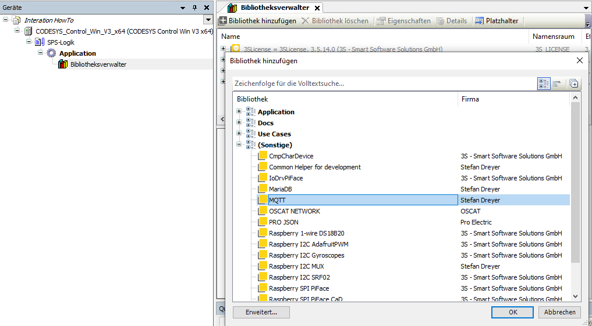
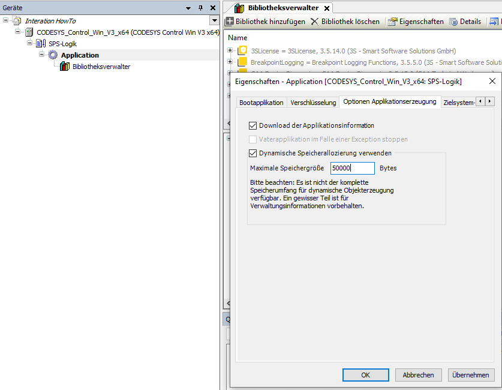
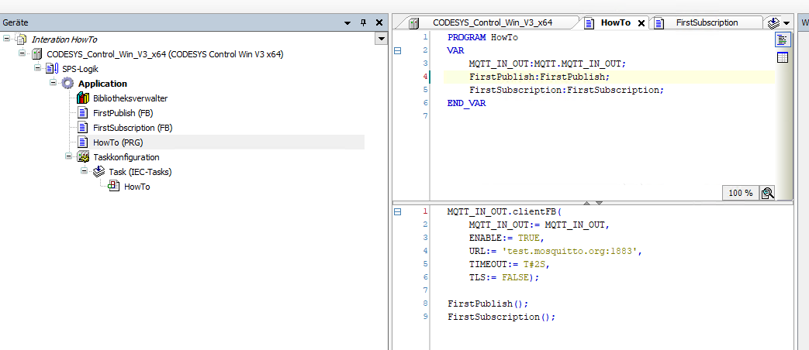
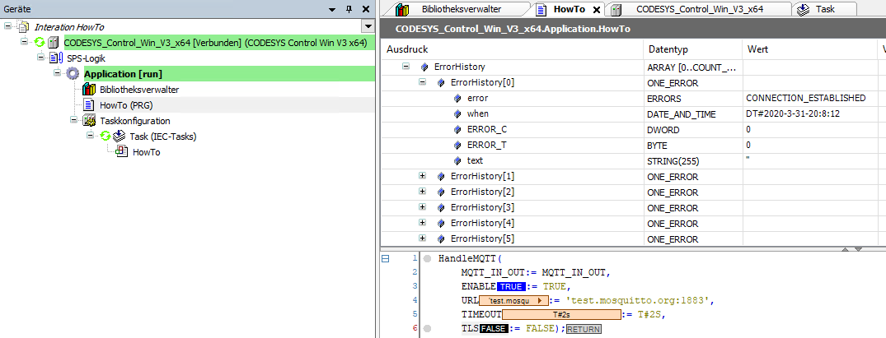
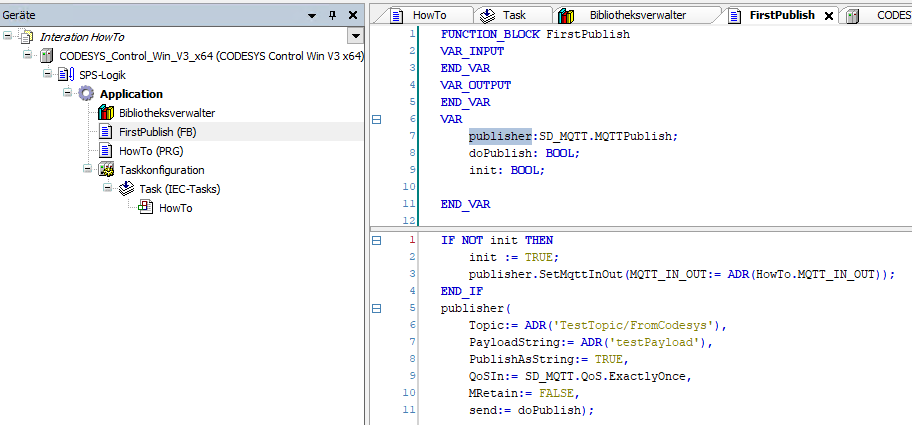
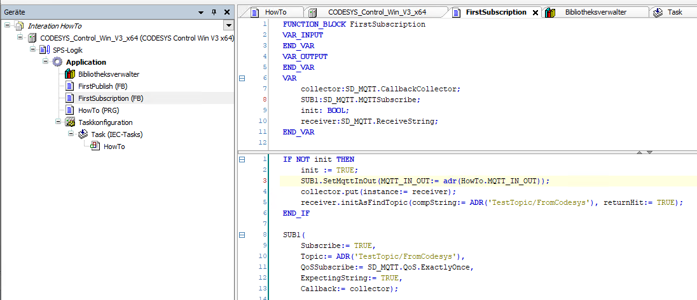

# How To and Documentation

## __Gerneral__

- after creating a new project you need to add the library

- then you have to activate dynamic memmory allocation

- right click on Application, then Option Application 
- missing librarys are available in my GitHub repositories

## __BASIC Handler__

- you need a struct of __SD_MQTT.MQTT_IN_OUT__ and a instance of __SD_MQTT.HANDLE_MQTT__ for communication to the broker
- this setup will communicate to the broker, but does not send or receive publish packets until now

## __DEBUGGING__

- in case of trobble, there is in the __SD_MQTT.HANDLE_MQTT__ instance a __ErrorHistory__ , there you will finds hints

## __first publish__

- make a instance of __SD_MQTT.MQTTPublish__
- you have to call __SET_MQTT_IN_OUT__ once, there your __SD_MQTT.MQTT_IN_OUT__ struct is the parameter
- call the instance, there you can define the topic, payload, QoS, retain
- payload can be a string or a byte array, for the array you must provide the length
- selection of string or array is done by the input __PublishAsString__ (True --> String, False --> Array)
- by setting the input __send__ to True, the packet is published
- use __done__ for checking if the transmit is done
- you can instance as much instances of __SD_MQTT.MQTTPublish__ as you like, the library is coordinating the rest
- the __SD_MQTT.HANDLE_MQTT__ FB atually is set up to handle 50 incomming and outgoing packets at once (QoS 1 and 2)
 

## __Subscriptions__

- now some basis knowlege on how I implemented the way subscriptions are handled.
- The FB __MQTTSubscribe__ is registering the subscription topic to the broker, additional 
	it registers the callback for the desired  topic in the __SD_MQTT.HANDLE_MQTT__ FB.
	Actuall 200 subscription topics can be registered. Now, if the broker sends a publish packet
	to the client, the __SD_MQTT.HANDLE_MQTT__ FB cheks to which subscription topic the received topic
	fits and then it calls the to the __SD_MQTT.MQTTSubscribe__ FB passed __PublishReceived__ method. To the 
	__PublishReceived__ method is passed a __Data:CALLBACK_DATA__. In this all needed data is available.
	I created some nice FB for easy use of callbacks: __ReceiveValue__, __ReceiveString__ with them
	you can start working. They can check topics, payloads and other stuff.
	The highest benefit of the callbacks is the callbackCollector. With the collector we are able to,
	collect as many instances of FBs(implementing the __MQTT_SUBSCRIBE_CALLBACK__ interface) as desired.
	The collector uses dynamic memmory allocation and is so limited by the ammount of available dynamic memmory.
	To use the collector you have to pass one instance of the collector to the subscription FB. Then
	use the __put__ method of the collector to add multiple instances of FBs to the collector. If a 
	publish packet is received, the collector calls all of the __PublishReceived__ methods registered
	to the collector. So each FB can check if the received packet fits to them. I use this technology im my 
	__CODESYS-ZIGBEE2MQTT__ library. With additional use of reflection, I'm able to create topics by names
	of FB instances.
- The other benefit of the collector is the speed. By using a collector all payload received in one cycle can
	be passed to the application. So if there are 20 publish packets in the buffer in one cycle, these 20 packets are passed
	to the application in exectly this cycle.
- So make a instance of an __CallbackCollectro__ and a __SD_MQTT.MQTTSubscription__ FB. Run some init stuff and with a recever
	you get your first data. like here:
	
	
	
## __Test it__

- I added the Integration HowTo Project to this repositiory, just have a look